# Track 1 데이터 파이프라인 다이어그램

이 문서는 Track 1 (데이터 파이프라인 + 파인튜닝)의 전체 흐름을 시각화한다.
GitHub에서 자동 렌더링되며, VSCode에서는 Mermaid 플러그인으로 미리보기 가능.

## 현재 상태

- ✅ **Stage 0 (전처리)**: 완료 — 원본 PDF에서 즐거운 학문 페이지 범위 추출
- ✅ **Marker (외부 도구)**: 완료 — Surya OCR + 레이아웃 분석
- ✅ **Stage 1 (텍스트 추출)**: 완료 — Marker JSON → ExtractedPage 변환
- ✅ **Stage 2 (섹션 감지)**: 완료 — 페이지별 역할 분류
- 🟡 **Stage 3 (청크 분할)**: 진행 중
- ⬜ Stage 4~7, 파인튜닝: 미작업

## 색상 범례

- 🟢 **초록색** (굵은 테두리): 완료된 스테이지
- 🟡 **노란색** (가장 굵은 테두리): 현재 작업 중
- 🟪 **인디고**: 외부 도구 (우리 코드 아님)
- ⬜ **회색**: 미작업
- 🔵 **파란색** 박스: 입출력 데이터
- 🩷 **분홍색** 박스: 코드 파일

## 갱신 방법

새 스테이지로 진입할 때마다:
1. 이전 스테이지 `class` 를 `done` 으로 변경
2. 현재 스테이지 `class` 를 `current` 로 변경
3. 상단 "현재 상태" 섹션 갱신
4. 동일 내용으로 `pipeline.mmd` 도 갱신

## 다이어그램

```mermaid
flowchart TB
    Start([니체 저서 PDF 합본]) --> S0

    subgraph S0[Stage 0 전처리 - 완료]
        direction TB
        S0_IN[입력: 원본 PDF<br/>예: 즐거운학문-원본.pdf 744p]
        S0_F1[page_extractor.py<br/>페이지 범위 추출]
        S0_F2[scripts/00_preprocess.py<br/>CLI 실행]
        S0_OUT[출력<br/>joyful_science_extracted.pdf 361p]
        S0_IN --> S0_F1 --> S0_F2 --> S0_OUT
    end

    S0 --> Marker

    subgraph Marker[Marker OCR + 구조화 - 외부 도구]
        direction TB
        M_F1[marker_single CLI<br/>Surya 모델 기반 OCR]
        M_OUT[출력<br/>marker_output/*.json]
        M_F1 --> M_OUT
    end

    Marker --> S1

    subgraph S1[Stage 1 ExtractedPage 변환 - 완료]
        direction TB
        S1_IN[입력<br/>Marker JSON 또는 PDF]
        S1_F1[marker_adapter.py<br/>Marker JSON → ExtractedPage]
        S1_F2[noise_filter.py<br/>좌표 기반 줄번호 필터]
        S1_F3[scripts/01_extract.py<br/>두 모드: PDF / Marker JSON]
        S1_OUT[출력<br/>pages.jsonl]
        S1_IN --> S1_F1 --> S1_F2 --> S1_F3 --> S1_OUT
    end

    S1 --> S2

    subgraph S2[Stage 2 섹션 감지 - 완료]
        direction TB
        S2_IN[입력<br/>pages.jsonl]
        S2_F1[books/joyful_science.py<br/>마커와 상수]
        S2_F2[section_detector.py<br/>상태 기계]
        S2_F3[scripts/02_segment.py<br/>CLI 실행]
        S2_OUT1[출력1<br/>sections.json]
        S2_OUT2[출력2<br/>pages_annotated.jsonl]
        S2_IN --> S2_F1
        S2_F1 --> S2_F2 --> S2_F3
        S2_F3 --> S2_OUT1
        S2_F3 --> S2_OUT2
    end

    S2 --> S3

    subgraph S3[Stage 3 청크 분할 - 진행중]
        direction TB
        S3_IN[입력<br/>pages_annotated.jsonl<br/>sections.json]
        S3_F1[aphorism_segmenter.py<br/>섹션별 분할 전략]
        S3_F2[scripts/03_segment_chunks.py]
        S3_OUT[출력<br/>chunks_raw.jsonl]
        S3_IN --> S3_F1 --> S3_F2 --> S3_OUT
    end

    S3 --> S4

    subgraph S4[Stage 4 Anchor 매핑]
        direction TB
        S4_IN[입력<br/>chunks_raw.jsonl<br/>영어 Gutenberg]
        S4_F1[anchors/gutenberg_parser.py<br/>영어 원전 파싱]
        S4_F2[alignment/mapper.py<br/>한영 매핑]
        S4_F3[scripts/04_map_anchor.py]
        S4_OUT[출력<br/>chunks_mapped.jsonl]
        S4_IN --> S4_F1 --> S4_F2 --> S4_F3 --> S4_OUT
    end

    S4 --> S5

    subgraph S5[Stage 5 LLM 정제]
        direction TB
        S5_IN[입력<br/>chunks_mapped.jsonl]
        S5_F1[refinement/llm_client.py<br/>vLLM 클라이언트]
        S5_F2[refinement/prompts.py<br/>정제 프롬프트]
        S5_F3[refinement/refiner.py<br/>배치 처리]
        S5_F4[scripts/05_refine.py]
        S5_OUT[출력<br/>chunks_refined.jsonl]
        S5_IN --> S5_F1
        S5_F1 --> S5_F2 --> S5_F3 --> S5_F4 --> S5_OUT
    end

    S5 --> S6

    subgraph S6[Stage 6 검증]
        direction TB
        S6_IN[입력<br/>chunks_refined.jsonl]
        S6_F1[validation/validators.py<br/>자동 + LLM 검증]
        S6_F2[scripts/06_validate.py]
        S6_OUT[출력<br/>chunks_validated.jsonl]
        S6_IN --> S6_F1 --> S6_F2 --> S6_OUT
    end

    S6 --> S7

    subgraph S7[Stage 7 SFT 변환]
        direction TB
        S7_IN[입력<br/>chunks_validated.jsonl]
        S7_F1[output/sft_formatter.py<br/>Pass1 질문 + Pass2 응답]
        S7_F2[scripts/07_format_sft.py]
        S7_OUT[출력<br/>sft_dataset.jsonl]
        S7_IN --> S7_F1 --> S7_F2 --> S7_OUT
    end

    S7 --> Train

    subgraph Train[파인튜닝]
        direction TB
        T_IN[입력<br/>sft_dataset.jsonl<br/>Gemma 4 26B-A4B]
        T_F1[QLoRA SFT 학습]
        T_OUT[출력<br/>파인튜닝된 모델]
        T_IN --> T_F1 --> T_OUT
    end

    Train --> Final([Track 2 vLLM 서빙])

    classDef done fill:#d1fae5,stroke:#059669,stroke-width:3px,color:#000
    classDef current fill:#fef3c7,stroke:#d97706,stroke-width:4px,color:#000
    classDef pending fill:#f3f4f6,stroke:#9ca3af,stroke-width:1px,color:#000
    classDef external fill:#e0e7ff,stroke:#4f46e5,stroke-width:2px,color:#000
    classDef io fill:#dbeafe,stroke:#2563eb,stroke-width:1px,color:#000
    classDef file fill:#fce7f3,stroke:#db2777,stroke-width:1px,color:#000
    classDef start fill:#fce7f3,stroke:#db2777,stroke-width:2px,color:#000

    class S0,S1,S2 done
    class Marker external
    class S3 current
    class S4,S5,S6,S7,Train pending
    class S0_IN,S0_OUT,M_OUT,S1_IN,S1_OUT,S2_IN,S2_OUT1,S2_OUT2,S3_IN,S3_OUT,S4_IN,S4_OUT,S5_IN,S5_OUT,S6_IN,S6_OUT,S7_IN,S7_OUT,T_IN,T_OUT io
    class S0_F1,S0_F2,M_F1,S1_F1,S1_F2,S1_F3,S2_F1,S2_F2,S2_F3,S3_F1,S3_F2,S4_F1,S4_F2,S4_F3,S5_F1,S5_F2,S5_F3,S5_F4,S6_F1,S6_F2,S7_F1,S7_F2,T_F1 file
    class Start,Final start
```

## 관련 문서

- `ml/ARCHITECTURE.md` — 파일별 역할 카탈로그
- `ml/docs/stage_cards/` — 각 스테이지의 상세 카드
- `ml/docs/diagrams/pipeline.mmd` — 순수 Mermaid 코드 (이 파일에서 추출)
